# slidev-theme-dmml

A [Slidev](https://sli.dev) theme for ASU's DMML Lab.

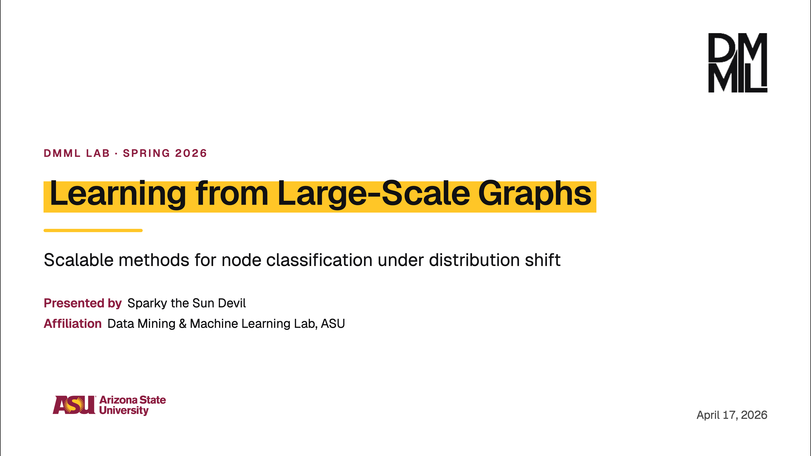

## Install

```bash
npm i -D slidev-theme-dmml
```

Then in your deck:

```yaml
---
theme: dmml
---
```

## Try the example deck

```bash
npm install
npm run dev      # http://localhost:3030
```

## Layouts

| Layout     | Purpose                                                  |
| ---------- | -------------------------------------------------------- |
| `cover`    | Title slide: large title, subtitle, presenter, date      |
| `intro`    | Presenter intro with avatar, role, affiliation, links    |
| `toc`      | Auto-generated table of contents (from `section` slides) |
| `section`  | Section divider (maroon field, gold accent)              |
| `default`  | Standard content slide (with optional `heading`)         |
| `two-cols` | Two-column layout with `::left::` / `::right::` slots    |
| `image`    | Image slide — full-bleed or side caption (`position`)    |
| `quote`    | Pull-quote with attribution                              |
| `end`      | Thank-you / Q&A closer with contact info                 |

See [`docs/layouts.md`](./docs/layouts.md) for per-layout frontmatter options.

## Gallery

|                                                |                                                    |
| ---------------------------------------------- | -------------------------------------------------- |
| 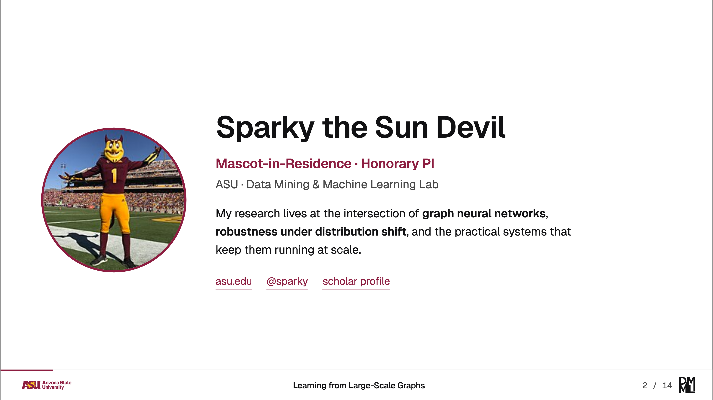           | 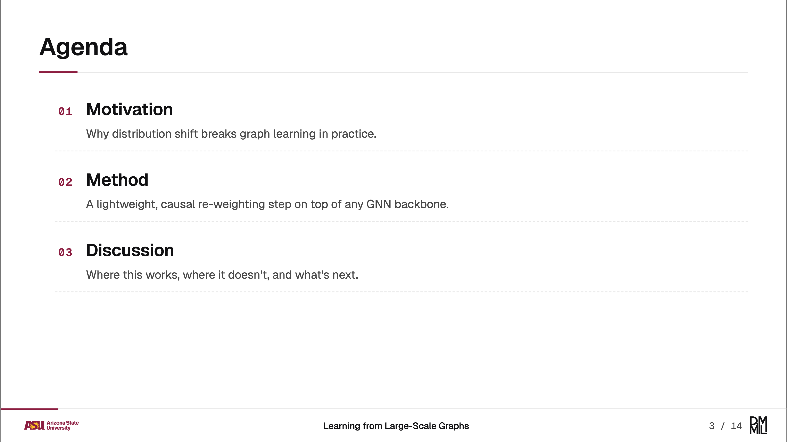                   |
| 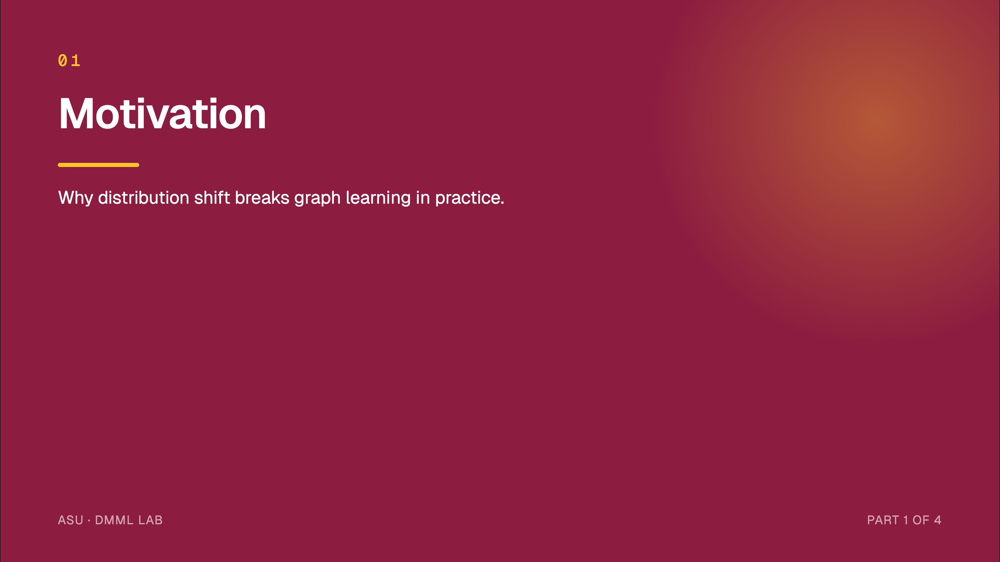       | 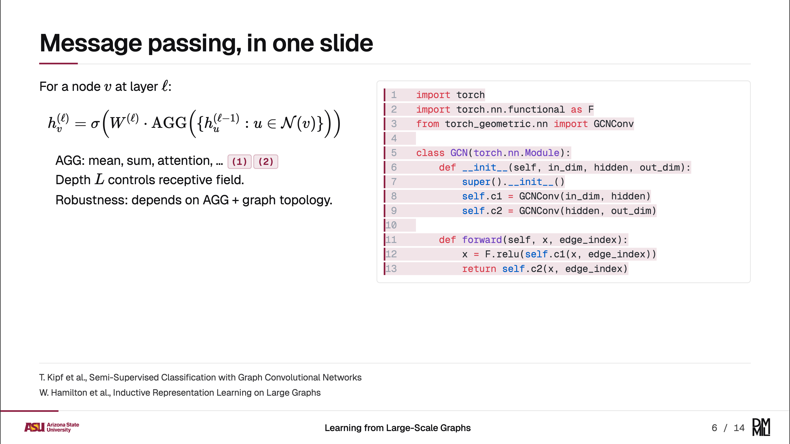         |
| 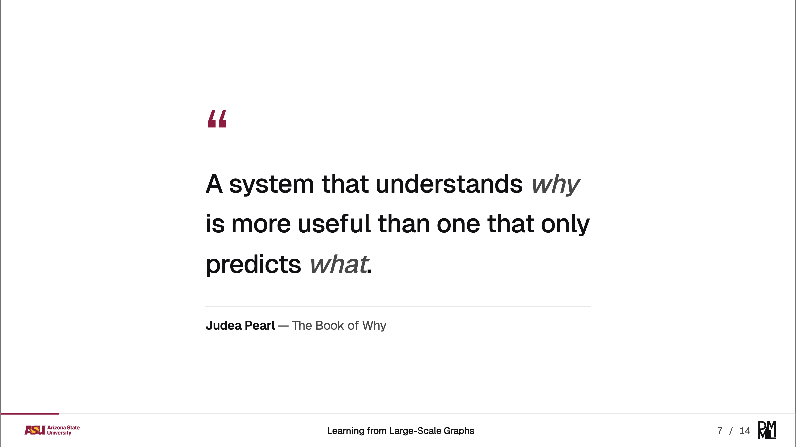           | 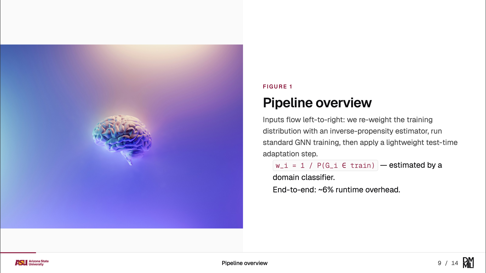               |
| 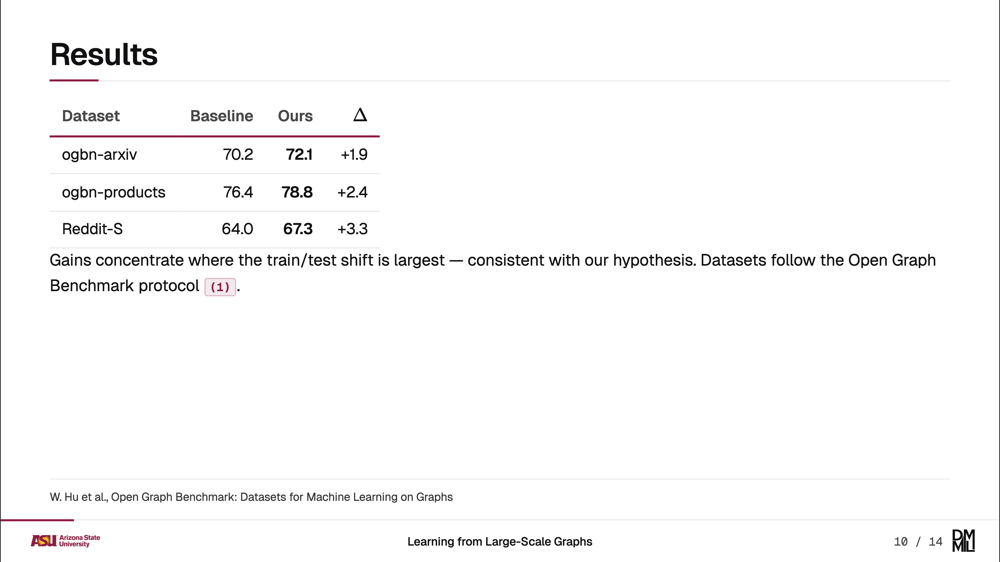   | 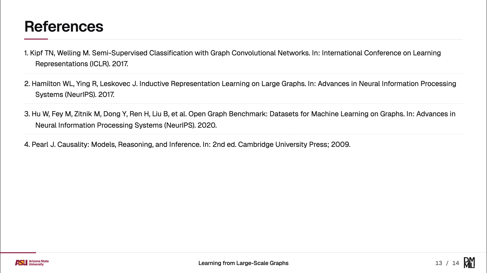     |
| 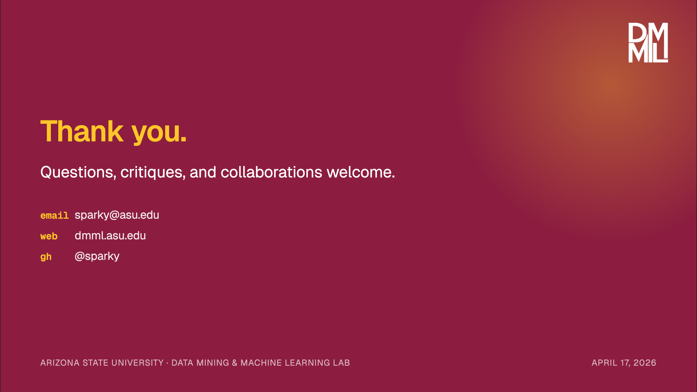               | 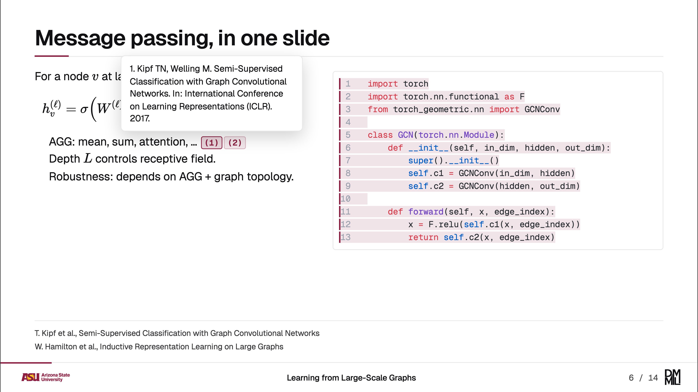|
| 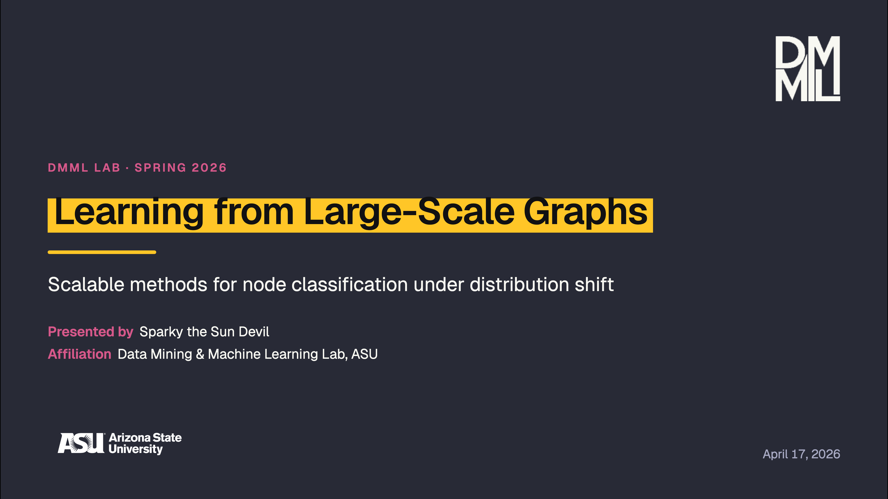 | 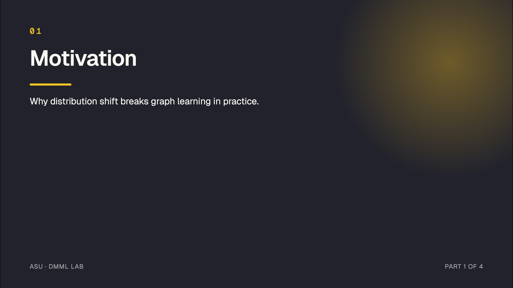 |

## Features

- **Light + dark** — toggle with `d`. ASU wordmark swaps variants automatically.
- **LaTeX** — Slidev's built-in KaTeX: `$inline$` and `$$block$$`.
- **Code** — Shiki (`github-light` / `github-dark`), line numbers, maroon line-highlight.
- **Typography** — Geist Variable + Geist Mono, bundled via `@fontsource-variable`.

## Docs

- [Getting started](./docs/getting-started.md) — dev vs build vs export
- [Layouts](./docs/layouts.md) — frontmatter for every layout
- [Customization](./docs/customization.md) — override colors, fonts, footer

## Credits

- ASU brand colors, wordmark, and sunburst — © Arizona State University. See the [ASU Brand Guide](https://brandguide.asu.edu/).
- [Geist](https://vercel.com/font) — Vercel, [OFL 1.1](https://github.com/vercel/geist-font/blob/main/LICENSE.TXT).
- DMML monogram redrawn as SVG.

## License

MIT
